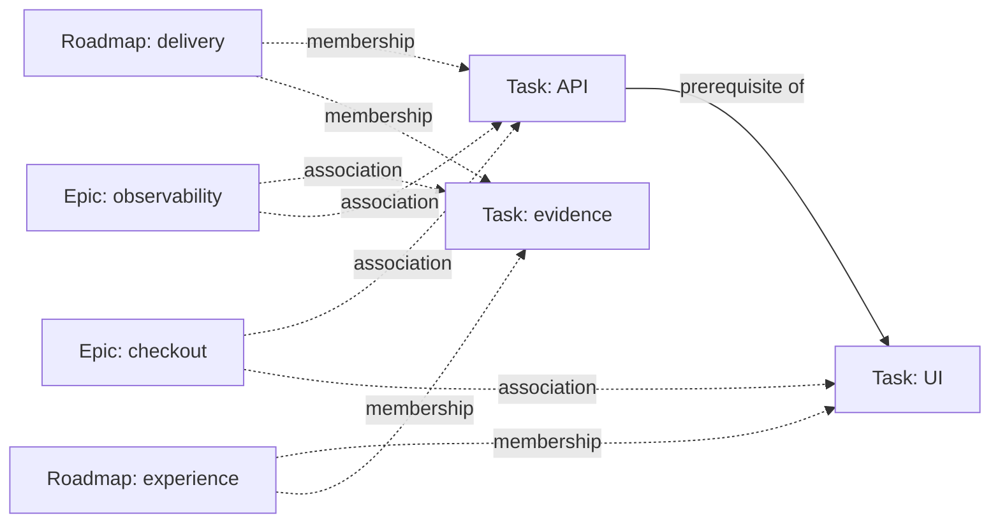

# Roadmaps and epics as orthogonal native core indexes

## Finding

**The hypothesis is supported and useful for this tasking system.** Roadmaps and
epics should be native protocol concepts, without imposing an Epic → Roadmap →
Task ownership tree. The evidence supports common durable semantics across this
family of repositories; it is not a statistical proof about all project systems.
Several specimens share ancestry, so their recurrence alone was not sufficient.
The distinct DAEMON structures and roadmap-free Dropzone cases test the boundary.

The earlier promotion test—whether any valid task graph can exist without a
concept—was too restrictive. It confused mandatory presence with native meaning.
A zero-roadmap repository is valid while a core reader still needs to understand
roadmaps when they appear. The better test is whether a relationship has uniform,
durable meaning needed to reconstruct intent and continued progress across the
supported tasking lifecycle, without importing project-specific execution policy.

## Evidence and counterchecks

Counts come from exact Git revisions and all task-bearing filename extensions,
including Dropzone Biz's non-Markdown records.

| Specimen | Tasks | Roadmaps | Epics | What it establishes |
| --- | ---: | ---: | ---: | --- |
| Fantastikt | 40 | 1 | 1 | The initial simple structure is a valid special case. |
| Loom | 269 | 20 | 1 | One capability scope spans many durable lines of advance. |
| Brule Message Bus | 16 | 7 | 3 | Domain, delivery, runtime, transport and acceptance lines recur beyond bootstrap. |
| Dropzone App | 41 | 0 | 11 | Useful task/epic universes exist without roadmaps. |
| Dropzone Biz | 35 | 0 | 11 | Roadmap absence must not make the native model invalid. |

The strongest counterexample to a tree is Geist's historical
`ROADMAP.geist.converse-tool-call-and-copyability`: its four task checklist entries
associate with **two different epics**, one covering tool prompt contracts and
the other covering the Converse interaction. A prerequisite crosses those epic
scopes explicitly through `depends_on`.

Platform's historical hardening and release roadmaps both reference
`TASK.alpha.034.spec-first-tooling`. Separately, its multi-roadmap policy limits
active execution to one primary lane with bounded secondary lanes, and says a
task belongs to one execution roadmap. Both facts must survive: overlapping
durable views are not a claim of simultaneous execution ownership. This is why
active-lane exclusivity belongs in policy rather than the basic membership type.

The source witnesses retain full original documents, exact GitLab revision IDs,
paths and SHA-256 hashes. They are explicitly historical evidence, not native
imports. [The source index](../conformance/src/test/resources/planning-history/sources.json)
contains all five local revision inventories and eleven DAEMON source artifacts.
`scripts/collect_planning_evidence.py` reproduces the read-only collection.

## Native-v1 recommendation

| Concept | Native meaning | Relationship |
| --- | --- | --- |
| Task | Atomic executable transition with bounded intent, acceptance and evidence | Prerequisite edges to tasks only |
| Roadmap | Durable named line of advance / swim lane | An ordered projection over task identities |
| Epic | Bounded feature or capability scope | A set of associated task identities |

Task prerequisites, roadmap membership and epic association are independent.
Allow zero or more memberships/associations. A repository profile can require a
single active execution lane or exactly one admitted epic where appropriate.
Core does not require one epic owner per roadmap, derive prerequisites from
ordering, or create extra execution nodes for planning records.

Persist each relationship once. For this draft, roadmaps and epics own their task
reference lists; task-to-roadmap and task-to-epic indexes are derived. Derive
roadmap-to-epic and epic-to-roadmap views by intersecting member task identities.
There is no separately authored parent edge that can disagree with those facts.

Roadmap order is durable presentation. Reordering the lane changes the planning
snapshot but cannot make a blocked task executable. Epic association order is
not semantic. Global frontier output deduplicates shared tasks. A selected
roadmap preserves its authored display order after full-universe readiness has
been evaluated. Selecting both roadmap and epic yields their intersection.

For example:



Only the solid task-to-task relationship is a causal edge. Dashed relationships
do not authorize execution or imply that a feature has been accepted.

## Executable draft

`PlanningRecord.kt` adds typed `RoadmapId`, `EpicId`, `TaskId`, `DraftRoadmap`,
`DraftEpic`, and a strict, source-preserving planning codec. Existing task
contracts remain `tasking/core-draft-1`; planning records use a separate draft
envelope. No historical schema is relabeled and native v1 remains unfrozen.

```yaml
protocol: tasking/planning-draft-1
kind: roadmap
id: ROADMAP.delivery
title: Durable delivery
intent: Advance fulfillment and its operational visibility.
tasks: [TASK.api, TASK.receipt]
extensions:
  project.priority/v1:
    tier: P1
```

```yaml
protocol: tasking/planning-draft-1
kind: epic
id: EPIC.checkout
title: Durable checkout
scope: Checkout survives process failure without losing fulfillment.
tasks: [TASK.api, TASK.ui]
```

Specialized attributes remain under `extensions`; required extension identities
remain separately core-readable. Unknown optional payloads retain source spelling,
comments and numeric precision during a core edit. Core top-level fields are
strict. Planning capability providers are not yet implemented: required planning
features allow inspection but fail executable frontier/closure decisions closed.
A task-only provider cannot masquerade as planning support.

`DraftUniverse` provides index diagnostics, reverse memberships, cross-index
views, selection, outside-roadmap prerequisite inspection, closure validation and
a deterministic universe snapshot digest. `DraftLifecycle.evaluate` is shared by
frontier and closure so the model does not introduce a second readiness engine.
Provider-contributed prerequisite edges are evaluated globally before filtering.

Planning edits change the universe view identity. They do not change an unchanged
task contract digest, so its historical evidence continues to address the same
contract. Changing task acceptance still invalidates that receipt for the changed
contract. Task requirements must not be inherited silently from an epic: if a
capability requires additional behavior, amend the task contract or bind an
explicit semantic requirement through the capability interface.

## Conformance and limits

Eight new native-model tests cover empty universes/indexes, overlapping roadmaps,
cross-roadmap epics, cross-epic roadmaps, shared tasks, deterministic projection,
missing/wrong-kind/duplicate references, global cycles, cross-view prerequisites,
provider contributions, snapshot/evidence independence and strict/lossless codecs.
Four historical tests bind the source hashes, demonstrate the actual cross-epic
roadmap, distinguish historical overlap from lane policy, and preserve the
roadmap-free cases. The full build passes **73 tests** with the no-top-type PSI
rule enabled. [Recorded test counts](proof/planning-model-tests.json) identify the
tested suites; the earlier [extraction proof](PROOF.md) remains a separate frozen
artifact result.

No product records, historical compatibility mappings, pinned extraction archives,
or consumer checkouts are migrated by this change. The native CLI/writer and full
protocol are still pending. Before freezing v1, specify planning archival versus
successful completion, explicit group evidence, and group contract/membership
snapshot binding. Closing all associated tasks must not automatically claim an
epic's entire scope or close a roadmap. Priority, primary-lane selection, admission,
concurrency, ownership and release gates remain policy/capability responsibilities.
