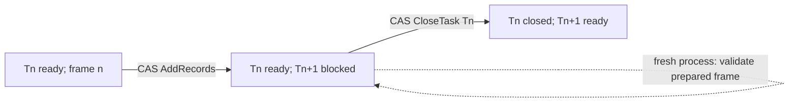

# A bounded falsification of the taskctl abstract-machine construction

The current lifecycle operations successfully execute a fixed two-counter machine.
They do not execute it unaided: a fixed three-instruction execution unit supplies
increment, decrement/zero-test, and branch selection. No new frame type, provider,
expression language, or protocol transition was needed for the specimens.

The stronger claim about the **literal current implementation with arbitrarily
much disk** fails. Its checked document limit and finite identity/locator spaces
prevent arbitrarily large frames and arbitrarily long append-only executions.
With an idealized unbounded, exact revisioned store, the same construction admits
the reduction below. These are different claims; the finite runs establish the
first, not an unconditional universality result for the shipped binary.

**RESULT: MINIMUM PRIMITIVE REQUIRED: unbounded exact revisioned state/instance
storage, for a literal unbounded-computation construction.** This is a storage and
identity capability, not a missing arithmetic or control-flow operation. Do not
add it to production merely to obtain a universality theorem.

## Scope and source identity

Inspected public `main`: `54603099da2fbb33eede4011f4fb8cf45a9ef48f` on
2026-09-07. The working checkout matched `origin/main` before this experiment.
Its production `core`, `repository`, and `cli/src/main` trees are unchanged from
the published alpha.2 source `8933bac1c090d175dfc035d7d52a40d1101f5333`.
The tests compile the checkout's current modules directly; they do not substitute
a mock ledger or invoke a historical implementation.

Read the contributor contract, native protocol, 0.3 semantic/currency docs,
extensions, pre-v1 checkpoint, implementation, and self-host graph. Added only
`TASK.research.abstract-machine`, with no prerequisites, alongside the existing
`TASK.migration.brule` frontier. Brule migration remains unstarted. The laboratory
uses disposable repositories; no machine instances enter the self-host graph.

The code is an opt-in `abstractMachine` source set, outside production and the
released JVM/native parity corpus:

- [FixedMachine.kt](../../conformance/src/abstractMachine/kotlin/io/brule/tasking/experiment/FixedMachine.kt)
- [AbstractMachineTest.kt](../../conformance/src/abstractMachine/kotlin/io/brule/tasking/experiment/AbstractMachineTest.kt)
- [Build task](../../conformance/build.gradle.kts)
- [Captured evidence manifest](abstract-machine/manifest.json)

All numbered source references below are pinned to the inspected commit.

## A. What currently implements each part

| Machine role | Current mechanism | Boundary |
| --- | --- | --- |
| Instruction-instance identity | Nominal `TaskId`; full immutable `TaskRevisionId` [S1, S4] | A task is not intrinsically an instruction. The lab assigns that interpretation. |
| Program storage | Typed `extensions["lab.minsky/v1"].program` in each revision [S2, S3, S4] | Optional, opaque data to core; finite label-to-instruction table. |
| Machine frame | Typed extension object containing `pc`, `counter0`, `counter1` [S2] | Lab decodes and validates it; authoritative copy is immutable HEAD's record. |
| PC / continuation | Frame's label chooses the opcode; singleton unfiltered frontier chooses the instance [S5] | Neither label dispatch nor machine-PC semantics are built into frontier. |
| Registers | `IntegerValue(BigInteger)` [S2] | Exact integral arithmetic, not floating point; concrete decoding is size limited [S9]. |
| Ready / issue set | Open tasks with closed prerequisites, no semantic blockers, and current currency [S5, S6] | Finite snapshot query. No automatic dispatch. |
| Execution / branch selection | Laboratory `executeOne` | Entire ALU is the three requested instruction forms. Core has no opcode evaluator [S5, S12]. |
| Dynamic instantiation | `Transition.AddRecords` [S5] | Successor is a fresh task, never a back-edge to an old task. |
| Commit / writeback | `FileTaskLedger.apply(expectedRevision, transition)` [S7] | Global ledger CAS, bounded journaled writes, cooperative file lock. Two transitions per non-HALT instruction. |
| Retirement | `CloseTask` after closure/currency/evidence checks [S5, S6] | Receipts are actor assertions, not independently verified arithmetic. |
| Halt | Close an instance containing HALT without creating a successor | Empty frontier is a consequence for this encoding, not a general definition of HALT. |
| Execution history | Appended immutable task revisions, observed dependency revisions, receipts [S4, S7] | Append-only during this construction; task projections and HEADs do change. |
| Unbounded history / storage | No literal unbounded guarantee [S1, S7, S9, S10] | Fixed decoder, digest identities, and generated locator space obstruct the infinite construction. |

The static prerequisite graph is **realized causal instruction memory**, not the
whole abstract program. The cyclic program table and the acyclic execution graph
are different objects. Prerequisites convey eligibility/completion and observed
semantic inputs; they do not automatically transport a counter value.

## B. Encoding and authority

Each open instruction instance carries this shape, using actual integer values:

```yaml
extensions:
  lab.minsky/v1:
    program:
      L0: {op: DECJZ, register: R0, nonzero: L1, zero: LH}
      L1: {op: INC, register: R1, next: L0}
      LH: {op: HALT}
    frame: {pc: L0, counter0: 5, counter1: 2}
```

The decoder accepts exactly these instruction forms, validates labels and branch
targets, and rejects negative, fractional, or non-integer counters. Counters are
not prose, decimal strings, a host-side cache, or hidden provider state. The
finite program is copied unchanged into each successor's immutable record.

| Candidate authority | CAS protected when written through taskctl? | Contract bound? | Historical preservation / suitability |
| --- | --- | --- | --- |
| Live optional extension projection | Yes through transitions; arbitrary file edits bypass CAS | No, in the minimal profile | Convenient view, but core allows optional annotation drift without changing HEAD. Insufficient as the sole machine authority. |
| Optional payload in immutable HEAD revision | Yes; full record participates in revision identity | Revision bound, **not** semantic-contract bound | Used here. Old values survive successor creation and closure. Hash guarantees have the qualifications below. |
| Required extension / activated profile payload | Required payload participates in contract projection [S6] | Yes | Current file adapter supports only the minimal profile; an unavailable/unpinned required provider blocks readiness and closure. No provider was added. |
| Named receipt evidence | Close is CAS controlled | Receipt addresses the semantic contract | Can name exact input/output revision identities, but core accepts a nonblank actor assertion without proving arithmetic. Used as trace evidence, not a trusted oracle. |
| Prose fields or unrelated files | Not used for frame state | Varies | Would obscure numeric typing or move authority outside the chosen ledger model. |

Every invocation reads `snapshot.history.head(current).record.extensions`.
It rejects any live projection whose extensions differ from immutable HEAD,
before writing. This is a **stepper discipline**, not a newly claimed core rule.
The optional-authority negative control demonstrates that core accepts projection
drift, and that a CAS revision of an optional payload changes full revision
identity while retaining the same semantic contract and current currency.

Consequently a machine program/frame edit does **not** trigger core semantic
invalidation merely because it changed optional data. A historical receipt still
addresses the same generic step contract. Its input-revision assertion identifies
which frame the actor purported to execute. The laboratory does not mistake that
for provider-verified evidence or semantic binding of the frame itself.

### One instruction, two durable microsteps

At a completed nonterminal instruction boundary, all earlier instances are closed
and exactly one task `Tn` is open/ready. Its immutable HEAD contains `(P, pc, r0, r1)`.

1. Read the snapshot and matching frontier revision. Refuse anything except one
   issue candidate. Look up one instruction and execute exactly one INC, DECJZ,
   or HALT operation.
2. For INC/DECJZ, CAS-add `T(n+1)` with the resulting frame and
   `requires: [Tn]`. Its dependency observation records `Tn`'s open revision,
   contract, and transitive input digest. It is blocked while `Tn` remains open.
3. CAS-close `Tn`, recording its input revision, selected branch, prepared successor
   revision, and a HALT flag in named actor evidence. The successor becomes the
   sole frontier task. Closing the predecessor changes its HEAD and lifecycle,
   but not its contract or semantic inputs, so this does not make the successor
   affected [S4]. Its observed open revision remains valid historical provenance.
4. For HALT, perform only closure and create no successor. The final frame is the
   HALT task's frame. Terminal evidence plus that instruction identify halt;
   an arbitrary blocked or empty repository is not thereby a halted machine.

The allocator increments a task-ID serial to obtain a fresh instance name. That
serial is administrative metadata, not a third program-visible register: no
opcode reads it, and neither PC nor counter values are derived from it. Lexical
sorting of `.10` and `.2` cannot affect execution because the issue set is singleton.



The instruction is **not one multi-transition atomic operation**. Preparation is
visible, but does not move the issue location. Closure is its retirement point.
If a process exits after preparation, a fresh process recomputes that one
instruction, verifies the existing successor equals the expected task, and closes
the predecessor without adding another successor. A stale expected ledger revision
fails before mutation. Concurrent interference requires reinspection; core does
not reserve the ready task for an actor. External clients that intentionally revise
the program or fabricate closure evidence are outside the fixed-stepper model.

The recovery test exits normally after a completed preparation CAS. It proves
reconstruction across process loss of memory at that boundary, not arbitrary
power-failure durability or every possible interruption inside a file transaction.
Core exposes explicit journal recovery for those cases [S7].

### Anti-cheating boundary

`executeOne` contains one opcode lookup and an exhaustive three-way dispatch.
INC adds one; DECJZ tests zero and otherwise subtracts one; HALT returns no frame.
There is no arbitrary expression evaluation, provider, shell command, model call,
network request, or executable program callback. The surrounding code performs
typed decoding, identity allocation, persistence, validation and trace recording.

JUnit starts a **fresh JVM for each invocation**, passing only the repository
path and, in one fault-injection call, `prepare-only`. The driver supplies bounded
fuel and checks final expected values; it never chooses a label, counter update,
or branch. Expected answers and instruction counts are test assertions, not seed
records. All successor frames are produced by the fixed unit from the persisted
input. The program can be changed as data without recompiling that unit.

## Actual runs and counterexamples

The following tables summarize captured JSON; `n` means `TASK.machine.step.n`.
Every non-HALT row has two CAS events, `prepare` then `retire`; HALT has one.
Frontier is `{n}` before each row, remains `{n}` after preparation, then is
`{n+1}` after retirement (empty after HALT). Full hashes, planned file writes,
branches, frames, HEAD maps, immutable revision bodies, receipts, and file digests
are retained in the linked evidence. Initialization uses `Bootstrap`'s exclusive
creation of a fresh ledger; instruction execution thereafter uses CAS.

Transfer program: `L0 DECJZ(R0,L1,LH); L1 INC(R1,L0); LH HALT`.

| n | PC | R0 | R1 | Decision |
| --- | --- | ---: | ---: | --- |
| 0 | L0 | 5 | 2 | nonzero |
| 1 | L1 | 4 | 2 | next |
| 2 | L0 | 4 | 3 | nonzero |
| 3 | L1 | 3 | 3 | next |
| 4 | L0 | 3 | 4 | nonzero |
| 5 | L1 | 2 | 4 | next |
| 6 | L0 | 2 | 5 | nonzero |
| 7 | L1 | 1 | 5 | next |
| 8 | L0 | 1 | 6 | nonzero |
| 9 | L1 | 0 | 6 | next |
| 10 | L0 | 0 | 7 | zero |
| 11 | LH | 0 | 7 | halt |

[Transfer evidence](abstract-machine/transfer.json): 12 instances, 23 instruction
CAS writes, 24 immutable revisions, 12 receipts. Final `(0,7)`.

Branch-heavy program:

```text
L0 DECJZ(R0,L1,L4)
L1 DECJZ(R1,L2,L3)
L2 INC(R0,L0)
L3 INC(R1,L0)
L4 HALT
```

| n | PC | R0 | R1 | Decision |
| --- | --- | ---: | ---: | --- |
| 0 | L0 | 2 | 2 | nonzero |
| 1 | L1 | 1 | 2 | nonzero |
| 2 | L2 | 1 | 1 | next |
| 3 | L0 | 2 | 1 | nonzero |
| 4 | L1 | 1 | 1 | nonzero |
| 5 | L2 | 1 | 0 | next |
| 6 | L0 | 2 | 0 | nonzero |
| 7 | L1 | 1 | 0 | zero |
| 8 | L3 | 1 | 0 | next |
| 9 | L0 | 1 | 1 | nonzero |
| 10 | L1 | 0 | 1 | nonzero |
| 11 | L2 | 0 | 0 | next |
| 12 | L0 | 1 | 0 | nonzero |
| 13 | L1 | 0 | 0 | zero |
| 14 | L3 | 0 | 0 | next |
| 15 | L0 | 0 | 1 | zero |
| 16 | L4 | 0 | 1 | halt |

[Branch-heavy evidence](abstract-machine/branch-heavy.json): 17 instances, 33 CAS
writes, 34 revisions, 17 receipts. Both DECJZ paths execute for both registers;
zero occurs three times and nonzero eight times. Final `(0,1)`.

Other executed probes:

| Probe | Observed result / evidence |
| --- | --- |
| Fresh-process resume; stale CAS; integer beyond `Long` | Started with `R0 = 10^80 - 1`; prepared one INC, exited, rejected an old CAS without any file change, resumed retirement, then HALT. Final `R0 = 10^80`; only two instances/four revisions. [Trace](abstract-machine/resume-cas.json). |
| Optional annotation authority | Projection drift accepted by core, rejected by stepper before mutation. CAS revision changed full HEAD, not contract. Deliberately unverified named assertion accepted by core as a negative control. [Evidence](abstract-machine/optional-authority.json). |
| Required unknown provider | Storage/inspection succeeded; frontier query and closure rejected unavailable provider. [Evidence](abstract-machine/required-provider.json). |
| Cycle / multiple issue candidates | Cyclic prerequisites rejected before writes; two independent tasks produce frontier size two and scalar stepper refuses to select one. [Evidence](abstract-machine/cycle-multifrontier.json). |
| Explicit storage ceiling | A valid JSON natural literal with 1,000,001 digits in a disposable task document was rejected with `The incoming YAML document exceeds the limit: 1000000 code points.` The failed read changed no files. This is a decoder-boundary probe, not a claimed successful CAS admission of that frame. [Evidence](abstract-machine/storage-boundary.json). |
| Typed instruction boundary | Negative/fractional counters and an unknown `EVAL` opcode rejected; typed HALT round-trip accepted. [Test results](abstract-machine/laboratory-tests.json). |

Across the positive/recovery specimens: 32 fresh process invocations, 31 retired
instructions and 59 successful instruction CAS transitions. The preparation-only
invocation accounts for the extra process. The tests compare bytes and mtimes of
all existing immutable history/receipt files and unrelated files between
invocations, retain every old file, check new paths stay within ledger/transaction
areas, and verify read-only snapshot/frontier/task calls leave bytes and mtimes
unchanged. A `.git/HEAD` sentinel, source sentinel, wrappers and toolchain lock all
remain untouched by execution. No OS network-isolation experiment was performed;
the execution path makes no network or Git calls, and launches no subprocess other
than the harness starting the fixed unit. Build dependency resolution is separate.

## C. Conditional reduction and the exact limit of the result

Let `P` be any finite program in the requested instruction language, and let its
configuration be `(pc,a,b)` with `a,b` natural numbers. Assume storage can represent
every finite program/frame, append every finite number of distinct instances and
revisions, and compare exact revision identities with CAS. Assume the executor is
invoked again while nonterminal and transient faults eventually stop. Time and
space efficiency are not part of the simulation claim.

Encode labels injectively as validated `L...` strings; encode the finite program
as a typed instruction map; encode both registers as exact `IntegerValue`s. Seed
one ready instance with the initial configuration. After `k` retired non-HALT
instructions maintain this invariant: a chain of `k` closed instances precedes
one ready instance whose immutable frame is exactly the source-machine
configuration after `k` steps. A prepared successor is an allowed intermediate
state, and does not change the represented issue configuration.

The base case is the seed. For INC, the fixed unit produces `(next,a+1,b)` or
`(next,a,b+1)`. For DECJZ, the selected register is tested for zero: zero selects
the zero label without changing registers; positive selects the nonzero label
and subtracts one. The other counter is unchanged. Preparation gives that exact
frame to a new blocked child. Retirement closes its predecessor and makes only
the child ready. Existing edges point from newer tasks to older prerequisites,
so induction preserves acyclicity and never requires an abstract loop to become
a prerequisite cycle. Full revisions and receipts are appended, not replaced.

For HALT, closure produces a terminal trace with no open successor. Conversely the
fixed executor produces that terminal trace only from HALT. Under the storage
assumptions, a source run with arbitrarily many steps can append arbitrarily many
instances. This establishes a step simulation, with preparation as a stuttering
microstep, rather than a demonstration that a host language can calculate the
answer for taskctl.

The exact opcode variant matters. Dudenhefner's CM2 uses increment with fall-through
and decrement with a positive-case jump and zero-case fall-through; its halting
problem is undecidable (Definition 2 and Theorem 6). His discussion also warns that
different restricted two-counter instruction sets can have different decidability
properties. Our language directly embeds CM2: at position `p`, map increment to
`INC(r,p+1)`, decrement/jump `q` to `DECJZ(r,q,p+1)`, and out-of-range termination to
an explicit HALT label. Thus this construction does not rely on an ambiguous use
of the name “Minsky machine.” [Dudenhefner, FSCD 2022](https://drops.dagstuhl.de/entities/document/10.4230/LIPIcs.FSCD.2022.16).

### Why the literal current backend does not discharge the assumptions

1. **Fixed document ceiling.** `YamlValues.parse` explicitly sets
   `codePointLimit = 1_000_000` [S9]. More disk cannot make the rejected natural
   literal readable. A larger finite constant still cannot represent every
   natural. The same decoder loads the single `.agents/history/heads.json`
   document [S7, S11], which grows with the number of tasks. Splitting a counter
   across additional tasks does not evade that HEAD-index bound.
2. **Finite immutable-identity namespace.** Revision and task-revision identities
   are exactly SHA-256 strings [S1]. A map keyed solely by those identities cannot
   identify infinitely many distinct retained revisions injectively. Collision
   resistance is a useful finite-run engineering assumption; it is not a
   mathematical injection on an unbounded set. No actual collision was sought or
   observed. The construction relies on distinct identities, not merely on extra
   physical storage.
3. **Finite generated task locator namespace.** `NativeFiles.fileName` retains at
   most 90 readable characters and 16 hexadecimal hash characters [S10]. The
   adapter rejects a generated locator that already exists [S7]. This too has
   finitely many possible names, despite the unbounded-looking TaskId grammar.

The decoder counterexample is executed evidence. The HEAD-index and finite-name
arguments are source inspection and pigeonhole arguments, not stress-test results.
Ordinary JVM/OS/physical-memory limits are additional implementation limits; the
ones above are explicit checked encodings that survive an assumption of unlimited
disk. Resource exhaustion or a rejected admission is **not HALT**.

If “ordinary unbounded storage” is intended to abstract away all scalar/index
limits **and** treat identities as exact and indefinitely fresh, the answer at
that abstraction level is **current lifecycle construction sufficient**. No new
computational operation is missing. For an exact theorem about current encodings,
those additional abstractions cannot be silently assumed.

### Minimum capability, not a production proposal

The missing capability for the literal stronger claim is an **unbounded exact
revisioned store**: arbitrary finite typed frames/programs; indefinitely fresh,
non-aliasing instance and revision identities; retained immutable values; and
exact expected-revision CAS. Existing AddRecords/CloseTask and the fixed ALU then
supply the entire reduction. This names the necessary storage capability, not a
claim of a unique or byte-minimal implementation.

A `MachineFrame` object with the present decoder ceiling and finite identity space
would not fix the obstruction. Conversely, no general expression evaluator is
needed. A chunked/unbounded representation would also have to address HEAD indexes,
locators, revision equality and history retention; a new filesystem adapter alone
cannot silently change the core's fixed digest identity rules. This experiment
does not implement or authorize those changes.

There is a separate possible product requirement: a payload whose meaning core
binds and verifies without trusting the actor. Optional revision data does not
provide that. A narrowly scoped required extension/provider could address such a
consumer requirement, but none is necessary for this cooperative fixed-stepper
construction, and none was counted toward its computational power.

## Multiple frontiers and the dataflow analogy

For ordinary operation, frontier is a ready **set**, not a scalar PC. Two
independent open/current tasks really produce two candidates in the negative
control. An external dispatcher may choose candidates or run different execution
units. Current taskctl does not implement claims, reservations, leases, dispatch
ownership, automatic retries, fairness or scheduling merely by returning frontier
[S5, S12]. Filtering to a roadmap does not establish exclusive execution authority.

| Analogy | What is warranted now |
| --- | --- |
| Prerequisites → operand availability | Completion and semantic-input eligibility; actual result transport is an actor/provider convention. |
| Frontier → issue queue | Computed ready set; no queue ownership or built-in dispatch. |
| Claims → reservation | **Absent in the current transition vocabulary.** A future scheduler concern, not an inferred core primitive. |
| Agents → execution units | External actors supply computation. The lab restricts this to a fixed three-opcode ALU. |
| Close → retire; receipts → completion evidence | Lifecycle transition with historical actor evidence, not a proof that a CPU/test runner performed work. |
| CAS → commit | One ledger-wide concurrency token serializes successful writes; unrelated concurrent work can conflict too. |
| Affected → invalidation | Semantic contract/transitive-input changes create review pressure. Closed work and old evidence survive; optional annotation drift alone is not semantic invalidation. |
| Reconcile → replay/revalidation | Explicit actor review with current observations and evidence [S4, S5], not automatic machine re-execution or rollback. |

Roadmaps and epics remain orthogonal task membership/association indexes [S8].
They can guide presentation or a caller's selection, but introduce no prerequisite
edge, processor register, ownership hierarchy or causal retirement order.

## Decidability and pre-v1 recommendation

For each finite valid DAG snapshot, taskctl can compute identity/reference validity,
cycle detection, topological dependency relations, present frontier, present
currency/affected causes, receipt applicability to a contract, and roadmap/epic
projections. A check of nonblank evidence cannot decide whether arbitrary claimed
work is actually correct. These finite graph computations do not simulate all
future actor actions.

For the **idealized unbounded fixed-stepper model**, the reduction makes general
HALT reachability undecidable. General label activation is undecidable by selecting
the distinguished halt label. General finiteness of the dynamic instruction trace
is undecidable because the executor keeps unrolling until HALT. Deciding whether
an arbitrary cyclic computation repeats finitely often is likewise not obtained
from acyclicity of each realized prefix. These are properties of evolving machine
runs, not of one finite prerequisite DAG.

The literal capped append-only specimen eventually halts or cannot extend its
representation. The unbounded theorem therefore does not establish undecidable
halting for that capped binary. It also does not turn resource failure into a
successful answer to the source machine's halting question. No broader claims
about unrelated properties such as uniform boundedness are made here.

**Adopt** the precise interpretation: taskctl is durable causal bookkeeping with
revisioned typed values, a ready-set query, and checked lifecycle commits; a fixed
execution unit can use it as a persistent instruction-instance substrate. Keep the
isolated regression specimen and the distinction between semantic contracts and
full revision identities.

**Defer** a first-class frame/provider, unbounded storage redesign, scheduler or
service until a real consumer needs it. **Reject** calling taskctl alone an
interpreter or changing native v1 just to obtain Turing completeness. The experiment
requires no production protocol change and gives no reason to freeze v1 now.

## Reproduction and validation

On Windows with the repository's Java 21 toolchain:

```powershell
.\gradlew.bat :conformance:abstractMachineTest --console=plain
.\gradlew.bat check --console=plain
```

The opt-in task writes fresh traces to `conformance/build/abstract-machine-evidence`.
Gradle can reuse an unchanged successful test output; add `--rerun-tasks` when a
new execution capture is required. Receipt timestamps intentionally make fresh
captures' receipt/file/ledger hashes different. The programs, step sequence,
counter values, branch decisions and task revision identities are reproducible.

Executed on Windows x86_64, Temurin Java `21.0.11+10`, Gradle `9.6.0`:

- **8 laboratory tests passed**, including 32 fresh JVM invocations. Initial
  compilation failed because the first test draft referenced internal repository
  helpers; the lab was corrected to use public typed decoding/bootstrap interfaces.
  No production visibility was widened. The next complete laboratory run passed.
- **`gradlew check` passed**: 18 conformance tests executed, including all three
  architecture/type-safety policies scanning the new Kotlin files. Other unchanged
  module tests were up-to-date, not rerun. [Recorded results](abstract-machine/conformance-tests.json).
- No native-image rebuild, packaged cross-platform parity run, release, service
  test, hardware-failure test, hash-collision search or infinite execution was
  performed for this research-only change.

Machine execution source and captured evidence are hashed in the manifest. Final
self-host research closure supplies named experiment/report evidence through the
existing verify/close CAS path. It does not close a migration task.

## Pinned current-source references

- **S1 — identities:** [Identities.kt, lines 19–88](https://github.com/brule-io/taskctl/blob/54603099da2fbb33eede4011f4fb8cf45a9ef48f/core/src/main/kotlin/io/brule/tasking/core/Identities.kt#L19-L88).
- **S2 — typed values and exact integers:** [Value.kt, lines 1–35](https://github.com/brule-io/taskctl/blob/54603099da2fbb33eede4011f4fb8cf45a9ef48f/core/src/main/kotlin/io/brule/tasking/core/Value.kt#L1-L35).
- **S3 — task record and reserved extension decoding:** [DraftRecord.kt, lines 4–61](https://github.com/brule-io/taskctl/blob/54603099da2fbb33eede4011f4fb8cf45a9ef48f/core/src/main/kotlin/io/brule/tasking/core/DraftRecord.kt#L4-L61).
- **S4 — immutable revisions, currency and projection validation:** [TaskHistory.kt, lines 18–155](https://github.com/brule-io/taskctl/blob/54603099da2fbb33eede4011f4fb8cf45a9ef48f/core/src/main/kotlin/io/brule/tasking/core/TaskHistory.kt#L18-L155).
- **S5 — ledger seam, frontier, transitions and dependency observations:** [TaskLedger.kt, lines 4–151](https://github.com/brule-io/taskctl/blob/54603099da2fbb33eede4011f4fb8cf45a9ef48f/core/src/main/kotlin/io/brule/tasking/core/TaskLedger.kt#L4-L151).
- **S6 — readiness, contract projection, unavailable providers and closure evidence:** [DraftLifecycle.kt, lines 17–122](https://github.com/brule-io/taskctl/blob/54603099da2fbb33eede4011f4fb8cf45a9ef48f/core/src/main/kotlin/io/brule/tasking/core/DraftLifecycle.kt#L17-L122).
- **S7 — native reads, CAS, prepared writes, journals and immutable file names:** [FileTaskLedger.kt, lines 13–191](https://github.com/brule-io/taskctl/blob/54603099da2fbb33eede4011f4fb8cf45a9ef48f/repository/src/main/kotlin/io/brule/tasking/repository/FileTaskLedger.kt#L13-L191).
- **S8 — planning indexes and frontier filtering:** [DraftUniverse.kt, lines 3–63](https://github.com/brule-io/taskctl/blob/54603099da2fbb33eede4011f4fb8cf45a9ef48f/core/src/main/kotlin/io/brule/tasking/core/DraftUniverse.kt#L3-L63).
- **S9 — fixed decoder limit and numeric decoding:** [YamlValues.kt, lines 14–45](https://github.com/brule-io/taskctl/blob/54603099da2fbb33eede4011f4fb8cf45a9ef48f/core/src/main/kotlin/io/brule/tasking/core/YamlValues.kt#L14-L45).
- **S10 — shared decoder and bounded generated locators:** [NativeFiles.kt, lines 21–62](https://github.com/brule-io/taskctl/blob/54603099da2fbb33eede4011f4fb8cf45a9ef48f/repository/src/main/kotlin/io/brule/tasking/repository/NativeFiles.kt#L21-L62).
- **S11 — full record in revision identity and monolithic HEAD map:** [HistoryCodec.kt, lines 38–68](https://github.com/brule-io/taskctl/blob/54603099da2fbb33eede4011f4fb8cf45a9ef48f/core/src/main/kotlin/io/brule/tasking/core/HistoryCodec.kt#L38-L68); [NativeCodec.kt, lines 5–17](https://github.com/brule-io/taskctl/blob/54603099da2fbb33eede4011f4fb8cf45a9ef48f/core/src/main/kotlin/io/brule/tasking/core/NativeCodec.kt#L5-L17).
- **S12 — current command vocabulary:** [NativeCommands.kt, lines 36–101](https://github.com/brule-io/taskctl/blob/54603099da2fbb33eede4011f4fb8cf45a9ef48f/cli/src/main/kotlin/io/brule/tasking/cli/NativeCommands.kt#L36-L101).
